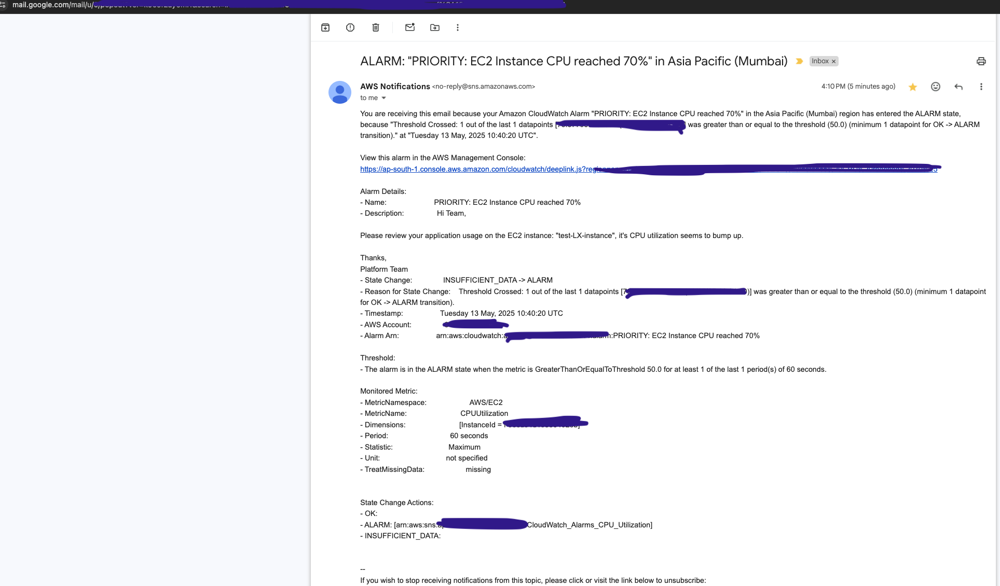
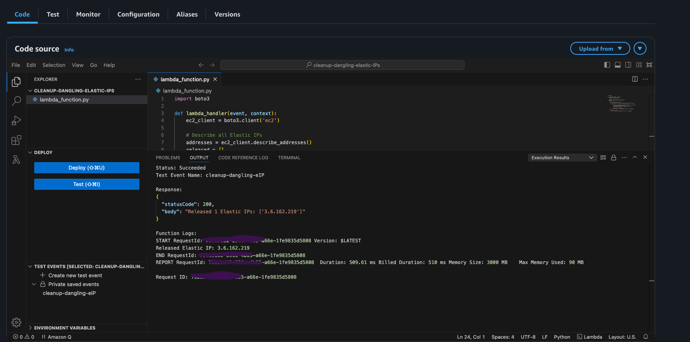

# aws-cloud-observability

This repository contains scripts and Lambda functions for AWS cloud observability and cost optimization.

### Example 1: CPU Load Simulation Script with CloudWatch Alarm with SNS Email Notification

This script simulates a CPU spike on an EC2 instance for a specified duration and CPU utilization percentage. Useful for testing CloudWatch alarms and monitoring setups.

- Integrated the EC2 `CPUUtilization` metric into a CloudWatch alarm to monitor for high CPU usage events.
- Configured the alarm to trigger when CPU utilization exceeds a defined threshold.
- Set up an SNS topic and subscribed an email address to receive notifications.
- When the alarm state changes (e.g., to ALARM), an email notification is sent as shown in the image below.

---
<p align="center">
  
</p>

---

#### Usage
- Edit the script to set your desired duration and CPU percentage.
- Run the script on your EC2 instance:

```sh
python3 increased_cpu_load.py
```

#### Stopping the Script

##### 1. Find the Process ID (PID)
Open a terminal and run:
```sh
ps aux | grep increased_cpu_load.py | grep -v grep | nl
```
Look for the line with your script and note the PID (the number in the second column).

##### 2. Force Kill (if needed)
If the process does not stop, use:
```sh
kill -9 <PID>
```

**Pro-Tip:**  
You can also stop the script by pressing `Ctrl+C` in the terminal where it is running.

---

### Example 2: Cost Optimization Lambda Functions for releasing Unused Elastic IPs and clean-up unused EBS volumes

- `cost-optimization/detect_unused_ebs_volm.py`: Detects and deletes unattached EBS volumes older than a specified age (in the example 30 days)

- `cost-optimization/detect_dormant_elastic_ips.py`: Automatically detects and releases unattached Elastic IP addresses.

---
<p align="center">
  
</p>

---
    
- Set up AWS EventBridge with a cron-based schedule to invoke the Lambda function every month.
    - **Example cron pattern:**  
      `cron(0 0 1 * ? *)`  
      (This runs the Lambda at 00:00 UTC on the 1st day of every month.)

- This automation helps reduce unnecessary costs by ensuring unused Elastic IPs are regularly released.
---

